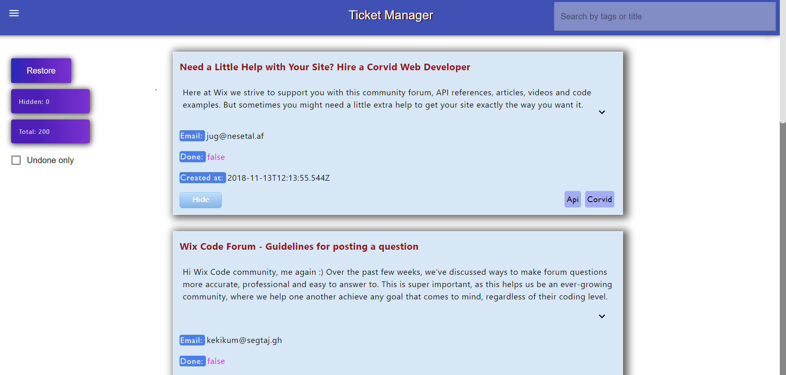
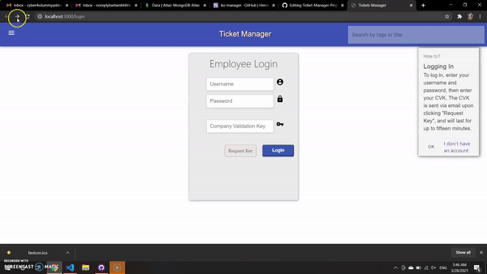
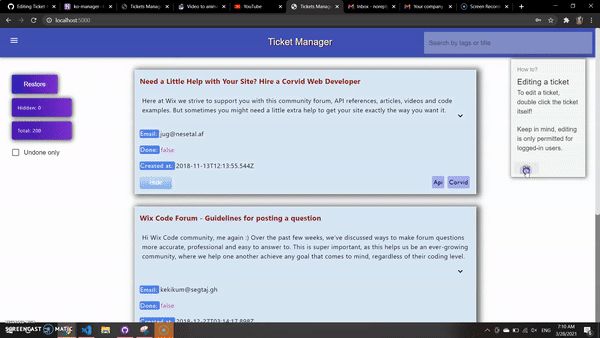
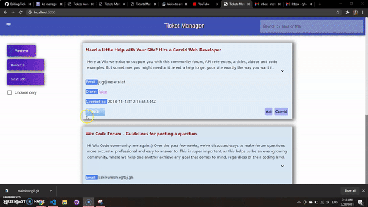
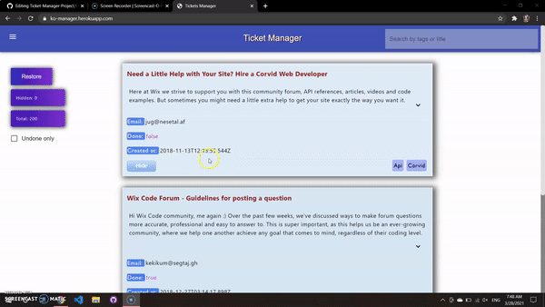

# Ko-manage: a ticket manager by Koren Ben Ezri

 
# Introduction

This is a Ticket Manager built with React.js, nodejs and MongoDB. 

## Usage

## Simply visit [this page](https://ko-managge.herokuapp.com/), and get TICKETING! 

A couple of the product's most prominent features include:

## Security: User authentication: hashing, cookie management and validation.

## Full-fledged Ticket system: editing tickets, records and dates for each response, correspondence system and email system: 

## Responding to tickets: 
### To respond to a ticket, simply double-click it. This will open the "Edit-mode" UI for the ticket, in which you will be able to choose who to reply to via email, write your response and view everything else you may need about the ticket.

## Usage: Features
### * Infinite scrolling - don't load more than you need!
 
* Secure.
* Easy-to-use, user-friendly ticket-system.
* Slick animations and design
* Logging for all correspondences including dates of each reply sent!

## For each ticket, you can:

* Edit
* Respond via mail
* All correspondences are logged and accessible via "edit mode".
* Filter by labels or 'done' status, server-side search available.
* Hide
* Mark as done

## Contributing
Pull requests are welcome. For major changes, please open an issue first to discuss what you would like to change.
Please make sure to update tests as appropriate.

## Current Contributors and credits

Koren BE

## License
Korenisimo, 2021

